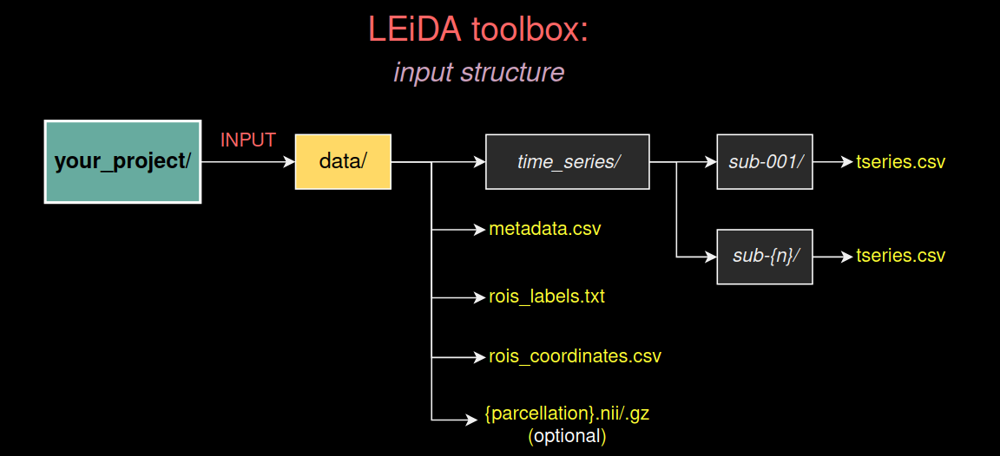
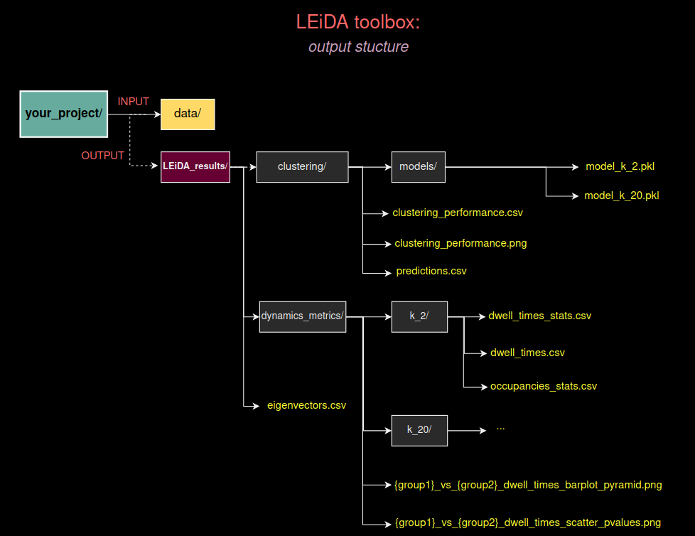

[](https://pepy.tech/project/pyleida)


# PyLeida

`pyleida` is a Python toolbox to apply the <i><b>Leading Eigenvector Dynamics Analysis</b></i> (<b>LEiDA</b>) framework to <i>functional magnetic resonance imaging (fMRI) data</i>. It contains all the necessary tools to apply the framework from the beggining to the end of the pipeline or workflow, save results, generate reports, and figures. 

<p>See <b>Cabral, J., Vidaurre, D., Marques, P., Magalhães, R., Silva Moreira, P., Miguel Soares, J., Deco, G., Sousa, N., & Kringelbach, M. L. (2017).</b><i> Cognitive performance in healthy older adults relates to spontaneous switching between states of functional connectivity during rest</i>. Scientific reports, 7(1), 5135. https://doi.org/10.1038/s41598-017-05425-7
  
## About LEiDA
 <b><i>LEiDA</i></b> is a powerful tool to characterize the temporal evolution of *dynamic functional connectivity (dFC)* based on *fMRI phase-coherence connectivity* with reduced dimensionality, which becomes useful in the analysis of multi-dimensional *dFC* data. Importantly, by focusing solely on its dominant connectivity pattern instead of the whole upper triangular part of the *phase-coherence* matrices, *LEiDA* is more robust to high-frequency noise, overcoming a limitation affecting all quasi-instantaneous measures of functional connectivity. Indeed, it allows detecting the precise epochs when the variance of the *dFC* becomes dominated by a different pattern, even if the *dFC* evolves more smoothly. Moreover, beyond significantly reducing the dimensionality of the data and allowing for *improved temporal resolution*, *LEiDA* offers the advantage that recurrences of the same pattern are more clearly detected, hence improving the signal-to-noise ratio in the functional connectivity dynamics *(DFC)* analysis.
  
## Installation
<h3><b>Dependencies</b></h3>
pyleida requires:
<ul style=“list-style-type:disc”>
  <li>Python (>=3.8)</li>
  <li>NumPy</li>
  <li>SciPy (>= 1.8)</li>
  <li>Scikit-Learn</li>
  <li>Pandas</li>
  <li>Matplotlib (>= 3.4.2)</li>
  <li>Seaborn</li>
  <li>Nilearn</li>
</ul>

### User installation
*pyleida* can be easely installed by introducing the following command:

```bash
#macOS users:
pip install pyleida

#Linux users:
pip3 install pyleida
```

An installation using a virtual environment is strongly recommended in order to avoid potential conflicts with other packages:
<li>Using a <i>conda virtual environment</i>:</li>

```bash
conda create --name pL python=3.9
conda activate pL

#Linux users: 
pip3 install pyleida

#macOS users:
pip install pyleida
```

<li>Using <i>pip venv</i>:</li>

```bash
#macOS users:
python -m venv pL
source pL/bin/activate
pip install pyleida

#Linux users:
python3 -m venv pL
source pL/bin/activate
pip3 install pyleida
```

Alternatively, we also provide an <i>environment.yml</i> file that can be use to create a stable virtual environment called <i>'pL'</i> that automatically installs the <i>pyleida</i> toolbox. To use this environment, just execute the following lines:

```bash
conda env create -f environment.yml
conda activate pL
```

## Usage

The <i>PyLeida</i> toolbox was created to facilite as much as possible the work required from the user. In this sense, althought the package contains all the necessary functions to allow the user to run all the processes manually step by step, the complete pipeline and exploration of results can be easely performed by using only the <i>Leida</i> class. 

### Input data



In order to execute the complete pipeline with the <i>Leida</i> class provided in the package, the user must create a folder (inside your project folder) with all the necessary files/data.
The following folders/files must/can be included:

- ***BOLD time series :*** the easiest way to organize and provide the BOLD time series is to create a folder called <i>'time_series'</i> containing a directory for each subject, inside of which a <i>.csv</i> file is located that contains the time series (N_ROIs x N_volumes) for that particular subject (see diagram above). Importantly, the subjects' folders must have as names their 'ids' (e.g., 'sub-0001','sub-0002'). Alternatively, instead of providing a single .csv file per participant the user can simply provide a single pickle file called <i>'time_series.pkl'</i> that contains a dictionary with the functional MRI data of each subject. In this case, keys must be the 'subject ids' and the values 2D arrays (N_ROIs x N_volumes) with the time series of each brain region/parcel.
- ***Metadata :*** another necessary piece of information to execute the pipeline is the metadata that specifies the group/condition of each subject scan or individual volume.  Here, the user must provide a 'metadata.csv' file with two columns: a 'subject_id' column that specifies the subjects ids, and a 'condition' column with a label specifying the group/condition of each subject or volume. In the most simple scenario, we want to assign each subject to a particular group/condition (for e.g., 'healthy control' or 'patient'). In this case, the <i>'metadata.csv'</i> file must contain a single row per subject (for e.g., 'sub-0001' in the 'subject_id' column, and 'patient' in the 'condition' column). However, in a more complex scenario, instead of assigning a simple group/condition label to the complete scan, we may want to assign a particular condition to each particular volume (for e.g., if we have conducted an experiment with a block design). In this case, the <i>'metadata.csv'</i> file must contain, for each subject, a row for each volume.
Alternatively, the user can simply provide a 'metadata.pkl' file with a dictionary having the subject_ids as keys, and lists with the labels as values.
- ***rois_labels.txt :*** a .txt file with the name/label of each brain region of our parcellation/atlas (a label per row). Importantly, the order of the parcels labels must coicide with the order in which the time series were provided in the corresponding .csv files or .pkl file.
- ***rois_coordinates.csv :*** a .csv file with the 3D coordinates (X,Y,Z) of each brain region/parcel in MNI space. These coordinates are necessary to create figures the represent each brain region as a node.
- ***{parcellation}.nii{.gz} (optional) :*** a .nii or .nii.gz file of the parcellation we have use to extract the fMRI time series. This file is necessary to create brain plots that show the identified the BOLD phase-locking states in cortical surface.

An example is provided in the 'data' folder of this repository.

### Running the analysis

Once the input data is correctly structured, running the LEiDA pipeline is straightforward:

```python
# Import the Leida class
from pyleida import Leida

# Instantiate the Leida class, specifying where our data is located
ld = Leida('data')

# Run the complete pipeline:
# Here, 'TR' specifies the Time Repetition of the fMRI data,
# 'paired_test' specifies whether the groups/conditions are
# independent or related, and 'n_perm' the number of permutations
# that will be used in the statistical analyses.
ld.fit_predict(TR=1.433,paired_tests=False,n_perm=5_000,save_results=True)


```
Once the process has finished, you can use the methods of the *Leida* object to explore the results and generate additional figures and contents. See the tutorials contained in the notebooks located in the 'examples' folder of this repository for more information.
### Output data



After running the *'fit_predict'* method, the package automatically creates a folder called <i>'Leida_results'</i> (see figure above).

Inside this folder, the user will find the following contents:
- A .csv file called *'eigenvectors.csv'* which contains, for each subject, the leading eigenvector of each time point/volume. The first column of this file specifies the subject id, the second column the group/condition, and the rest of the columns the values of each brain region/parcel.
- A folder called 'clustering', which contains: 
    - A *'models'* folder containing a .pkl file for each fitted KMeans model.
    - A *'predictions.csv'* file that contains, for each K partition, the predicted cluster label for each subject volume/time point. Similar to *'eigenvectors.csv'*, the first column of this file specifies the subject id, the second column the group/condition, and the rest of the columns the K partitions (K_2, K_3, ..., K_20).
    - A *'clustering_performance.csv'* file, which contains the computed Dunn score, distortion, Silhouette score, and Davies-Bouldin score for each K partition.
    - A *'clustering_performance.png'* image file that shows the information of the *clustering_performance.csv'* file.
- A folder called 'dynamics_metrics' that contains:
    - Figures showing the results of the statistical analysis comparing each pair of conditions across all the K partitions, and
    - A folder for each K partition (k_2,k_3,...,k_20), containing files with the computed Fractional Occupancies, Dwell Times, Transitions Probabilities, as well as the results of the statistical analyses of Dwell Times and Fractional Occupancies.


## Help and support
### Tutorials
Jupyter notebooks with examples is provided in the 'examples' folder of this repository.

### Documentation
A detailled description of the package API can be founded here: https://PSYCHOMARK.github.io/pyleida/

### Communication

<li>adeleglise@fmed.uba.ar</li>
<li>jakub.vohryzek@gmail.com</li>
<li>joanacabral@med.uminho.pt</li>

### Citation

If you use `pyleida` in a scientific publication, please cite: https://

For more detailed descriptions and applications, please refer to the following works:

> *Joana Cabral, Diego Vidaurre, Paulo Marques, Ricardo Magalhães, Pedro Silva Moreira, José Miguel Soares, Gustavo Deco, Nuno Sousa and Morten L. Kringelbach (2017). [Cognitive performance in healthy older adults relates to spontaneous switching between states of functional connectivity during rest](https://doi.org/10.1038/s41598-017-05425-7). **Scientific Reports***

> *Miguel Farinha, Conceição Amado, Pedro Morgado and Joana Cabral (2022). [Increased Excursions to Functional Networks in Schizophrenia in the Absence of Task](https://doi.org/10.3389/fnins.2022.821179). **Frontiers in Neuroscience***

> *Louis-David Lord, Paul Expert, Selen Atasoy, Leor Roseman, Kristina Rapuano, Renaud Lambiotte, David J. Nutt, Gustavo Deco, Robin Carhart-Harris, Morten L. Kringelbach and Joana Cabral (2019). [Dynamical exploration of the repertoire of brain networks at rest is modulated by psilocybin](https://doi.org/10.1016/j.neuroimage.2019.05.060). **Neuroimage***

> *Caroline A. Figueroa, Joana Cabral, Roel Mocking, Kristina Rapuano, Tim J. van Hartevelt, Gustavo Deco, Paul Expert, Aart H. Schene, Morten L. Kringelbach and Henricus G. Ruhé (2019). [Altered ability to access a clinically relevant control network in patients remitted from major depressive disorder](https://doi.org/10.1002/hbm.24559). **Human Brain Mapping***

> *Gustavo Deco, Josephine Cruzat, Joana Cabral, Enzo Tagliazucchi, Helmut Laufs, Nikos K. Logothetis and Morten L. Kringelbach (2019). [Awakening: Predicting external stimulation to force transitions between different brain states](https://doi.org/10.1073/pnas.1905534116). **Proceedings of the National Academy of Sciences***

> *Eloise A. Stark, Joana Cabral, Madelon M. E. Riem, Marinus H. Van IJzendoorn, Alan Stein and Morten L. Kringelbach (2020). [The power of smiling: the adult brain networks underlying learned infant emotionality](https://doi.org/10.1093/cercor/bhz219). **Cerebral Cortex***

> *Morten L. Kringelbach, Josephine Cruzat, Joana Cabral, Gitte Moos Knudsen, Robin Carhart-Harris, Peter Whybrow, Nikos K. Logothetis and Gustavo Deco (2020). [Dynamic coupling of whole-brain neuronal and neurotransmitter systems](https://doi.org/10.1073/pnas.1921475117). **Proceedings of the National Academy of Sciences***

> *Daouia I. Larabi, Remco J. Renken, Joana Cabral, Jan-Bernard C. Marsman, André Aleman and Branislava Ćurčić-Blake (2020). [Trait self-reflectiveness relates to time-varying dynamics of resting state functional connectivity and underlying structural connectomes: Role of the default mode network](https://doi.org/10.1016/j.neuroimage.2020.116896). **NeuroImage***

> *Jakub Vohryzek, Gustavo Deco, Bruno Cessac, Morten L. Kringelbach and Joana Cabral (2020). [Ghost Attractors in Spontaneous Brain Activity: Recurrent Excursions Into Functionally-Relevant BOLD Phase-Locking States](https://doi.org/10.3389/fnsys.2020.00020). **Frontiers in Systems Neuroscience***

> *Sonsoles Alonso Martínez, Gustavo Deco, Gert J. Ter Horst and Joana Cabral (2020). [The dynamics of functional brain networks associated with depressive symptoms in a nonclinical sample](https://doi.org/10.3389/fncir.2020.570583). **Frontiers in Neural Circuits***

> *Wan-wa Wong, Joana Cabral, Riddhi Rane, Ronald Ly, Morten L. Kringelbach and Jamie D. Feusner (2021). [Effects of visual attention modulation on dynamic functional connectivity during own-face viewing in body dysmorphic disorder](https://doi.org/10.1038/s41386-021-01039-w). **Neuropsychopharmacology***

> *Ricardo Magalhães, Maria Picó-Pérez, Madalena Esteves, Rita Vieira, Teresa C. Castanho, Liliana Amorim, Mafalda Sousa, Ana Coelho, Henrique M. Fernandes, Joana Cabral, Pedro S. Moreira and Nuno Sousa (2021). [Habitual coffee drinkers display a distinct pattern of brain functional connectivity](https://doi.org/10.1038/s41380-021-01075-4). **Molecular psychiatry***
